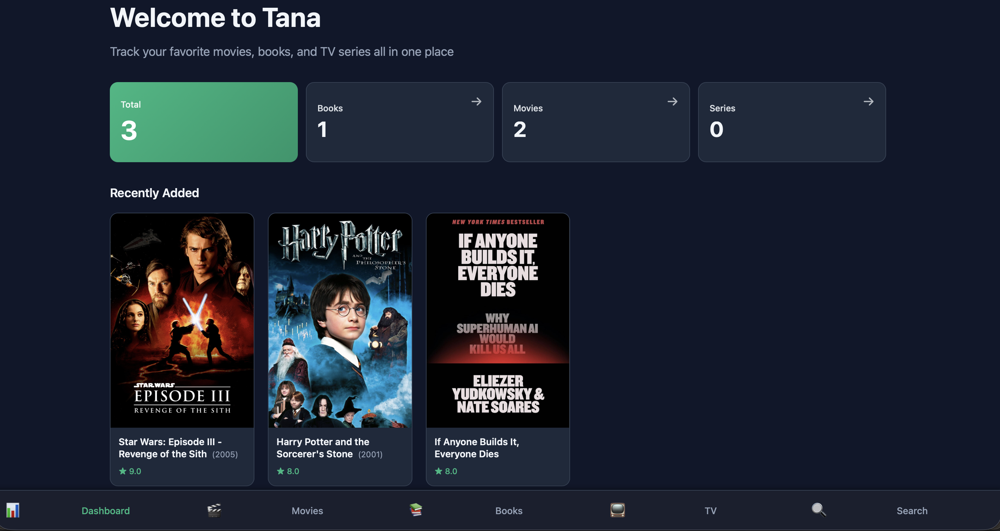
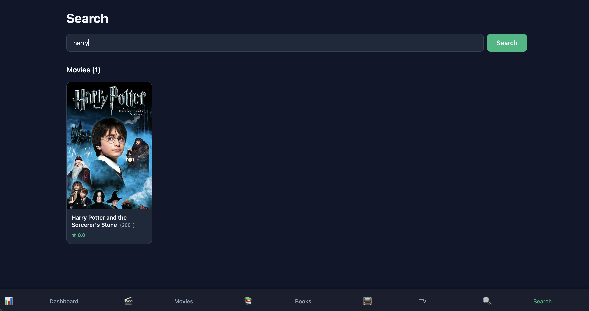
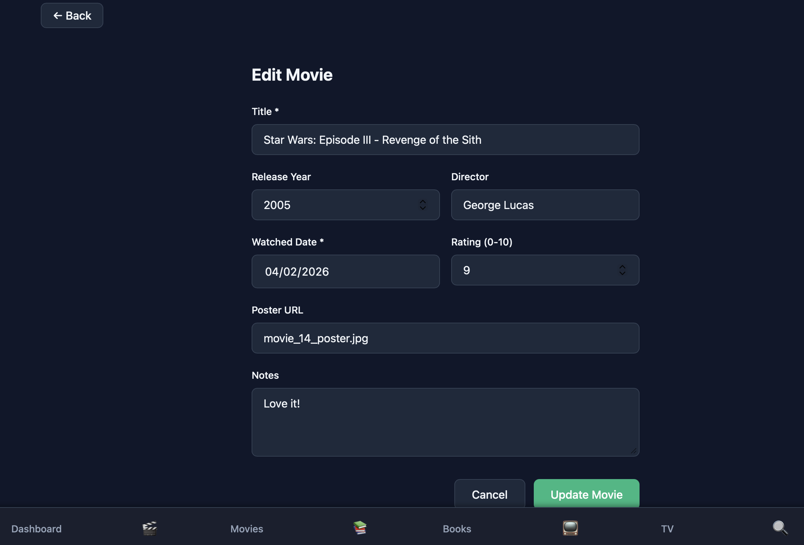

# 🗄️ Tana - Media Tracking CLI Tool

Tana (Japanese: 棚 for "shelf") is a Rust-powered media tracker featuring a lightweight CLI, REST API server, and modern SvelteKit web dashboard. Built with SQLite for persistent storage and designed with extensibility in mind. Includes containerized deployment with Docker and automated CI/CD via GitHub Actions for testing and GHCR releases. I built it mainly for myself to keep track of my media consumption, but it's open source and contributions are welcome!

## 🎯 Multi-Interface Design

Tana is designed to work seamlessly across multiple interfaces. The command-line interface is the primary way to interact with your media library, offering full power and flexibility. The modern SvelteKit web interface is an optional companion that provides a visual, browser-based way to manage your collection. The REST API enables programmatic access and custom integrations. Whether you prefer the terminal, web browser, or API—Tana adapts to your workflow.

- **Lightweight CLI**: Fast, scriptable, and perfect for automation
- **Modern Web UI**: Browse and manage your media with a SvelteKit-powered interface
- **REST API**: Programmatic access for custom integrations and tools
- **Your Choice**: Use any combination—they all work together seamlessly

## 🚀 Quick Start

### Installation
```bash
cargo install --path .
```

### Basic Usage
```bash
# Add a movie
tana add movie "The Matrix" --rating 9.0

# Add a book
tana add book "1984" --rating 8.5

# Show all movies
tana show movies

# Show all books
tana show books

# Edit an entry
tana edit movie 1 --rating 9.5
```

For more detailed commands and options, run:
```bash
tana --help
```

## 📸 Screenshots

Get a glimpse of Tana's web interface:

### Dashboard

View your entire media collection at a glance with statistics and quick access.

### Movies Library

Browse and organize your movie collection with filters and sorting options.

### Search & Filter

Quickly find what you're looking for with powerful search and filtering capabilities.

### Item Details

View comprehensive information about each media item including ratings and descriptions.

### Edit Entry

Easily update media details with an intuitive editing interface.

## 🛠️ Technology Stack

Tana is built with modern, production-ready technologies:

**Backend:**
- **Rust** - Fast, safe, and reliable systems programming
- **Axum** - Ergonomic and modular web framework
- **SQLite** - Lightweight, serverless database
- **Tokio** - Async runtime for high performance

**Frontend:**
- **SvelteKit** - Modern, full-stack framework with SSR support
- **Svelte 5** - Reactive, component-driven UI
- **TypeScript** - Type-safe development
- **Vite** - Lightning-fast build tool

**DevOps & Deployment:**
- **Docker & Docker Compose** - Containerized deployment
- **GitHub Actions** - Automated testing and CI/CD
- **GitHub Container Registry (GHCR)** - Container image hosting

## 🐳 Docker Deployment

### Two Docker Compose Configurations

Tana includes two Docker Compose files for different use cases:

- **`docker-compose.yml`** (Production): Uses pre-built images from GitHub Container Registry (GHCR). Recommended for running released versions.
- **`docker-compose.dev.yml`** (Development): Builds images locally from source code. Use this if you're developing or running from the latest code.

### Quick Start with Released Images (Production)

For the easiest way to run a released version of Tana:

```bash
# Copy the example environment file
cp .env.example .env

# Start the application
docker-compose up
```

This command will:
- Pull pre-built Docker images from GitHub Container Registry
- Start the API server on `http://localhost:8080`
- Start the web interface on `http://localhost:3000`
- Persist your data locally

### Quick Start with Local Build (Development)

To build and run from the latest source code:

```bash
docker-compose -f docker-compose.dev.yml up
```

This command will:
- Build optimized Docker images locally from source code
- Start the API server on `http://localhost:8080`
- Start the web interface on `http://localhost:3000`
- Create and persist data locally

### Access the Application

Once the services are running:
- **Web Interface**: http://localhost:3000
- **REST API**: http://localhost:8080/api
- **API Documentation**: http://localhost:8080/api/docs (Swagger UI with interactive testing)
- **Health Check**: http://localhost:8080/api/health

### REST API Features

The REST API provides full programmatic access to manage your media library:
- **CRUD Operations**: Create, read, update, and delete media entries
- **Search & Filtering**: Query your collection by title, type, rating, and more
- **Image Management**: Upload and serve media images
- **Health Monitoring**: Monitor service status and availability
- **Swagger UI**: Interactive API documentation and testing interface at `/api/docs`

You can use the REST API with tools like `curl`, Postman, or any HTTP client in your preferred programming language.

### Data Persistence

Both the database and media images are automatically persisted in a Docker named volume called `tana-data`. This means your data will survive container restarts and updates.

To view the current data location:
```bash
docker volume inspect tana-data
```

To completely remove all data:
```bash
docker-compose down -v
```

### Build Individual Services

If you want to build the Docker images separately:

```bash
# Build backend API
docker build -t tana-api backend/

# Build frontend web interface
docker build -t tana-web frontend/

# Run backend
docker run -p 8080:8080 -v tana-data:/home/tana/.local/share/tana tana-api

# Run frontend (in another terminal)
docker run -p 3000:3000 tana-web
```

### Environment Variables

Both Docker Compose configurations support the following environment variables:

**Available Variables:**
- `TANA_VERSION`: Version of Docker images to use (default: `latest`). Can be a specific release like `v0.1.0` or `latest`.
- `RUST_LOG`: Logging level for the backend API (default: `info`, options: `trace`, `debug`, `info`, `warn`, `error`)

**Configuration:**

A `.env.example` file is provided as a template. To customize settings:

```bash
cp .env.example .env
# Edit .env with your desired values
docker-compose up
```

Example `.env` file:
```bash
TANA_VERSION=latest
RUST_LOG=info
```

To pin a specific release version:
```bash
TANA_VERSION=v0.1.0
RUST_LOG=debug
```

### Health Checks

Both services include health checks that run every 10 seconds. You can view the health status with:

```bash
docker-compose ps
```

Look for the `(healthy)` or `(unhealthy)` status indicators.

### Stop and Clean Up

```bash
# Stop all services
docker-compose down

# Stop and remove volumes (delete all data)
docker-compose down -v

# Remove images
docker-compose down --rmi all
```

### Troubleshooting Docker

**API service won't start:**
- Check logs: `docker-compose logs api`
- Ensure port 8080 is available
- Verify the database volume has write permissions

**Web interface won't load:**
- Check logs: `docker-compose logs web`
- Ensure port 3000 is available
- Verify the API service is running and healthy

**Permission denied on data volume:**
```bash
docker-compose down -v
docker-compose up
```

**Port already in use:**
Modify the port mappings in `docker-compose.yml`:
```yaml
api:
  ports:
    - "8081:8080"  # Map to 8081 instead
web:
  ports:
    - "3001:3000"  # Map to 3001 instead
```

## 🤖 AI Disclaimer

This project was developed with the assistance of GitHub Copilot, an AI code generation tool. I know this is a controversial topic. While Copilot helped me speed up development and provided useful suggestions, all code was reviewed and edited by me to ensure quality and correctness. The final implementation reflects my design choices and coding style. Below is a bit of my take on using AI tools in software development, if you're interested.

<details>
  <summary>My Take on AI Assistance</summary>
  
  > I started programming in 2018 and have therefore been coding for nearly 10 years in various languages (mainly Python, Lua, C++, and Rust). I'm still learning every day, but I would argue I have a fairly good understanding of programming concepts, design patterns, and best practices. I'm not particularly interested in vibe-coding (specifically the part where AI writes code without human review), but I see AI tools like Copilot as powerful assistants that can help with boilerplate code, suggest solutions, and speed up development. As long as the developer maintains control, reviews the code, and ensures it meets quality standards, I think AI can be a valuable tool in the software development process. It's not about replacing developers but augmenting their capabilities. In this project, I used Copilot to generate code snippets, but I made sure to review and edit everything to ensure it aligned with my vision for the project. The end result is a product of both human creativity and AI assistance.
  
</details>

## 📜 License

Licensed under either of

 * Apache License, Version 2.0
   ([LICENSE-APACHE](LICENSE-APACHE) or http://www.apache.org/licenses/LICENSE-2.0)
 * MIT license
   ([LICENSE-MIT](LICENSE-MIT) or http://opensource.org/licenses/MIT)

at your option.

## 🔧 Troubleshooting

### Database Not Found
If you get a "database not found" error, the database will be created automatically on the first run. Make sure the `~/.local/share/tana/` directory exists and is writable.

### Permission Denied
```bash
chmod 755 ~/.local/share/tana/
```

### Clear All Data
```bash
rm ~/.local/share/tana/tana.db
```

The database will be recreated with a fresh schema on the next run.

### Debug Information
Run with the `--debug` flag to see detailed logs:
```bash
tana --debug show movies
```

## 🤝 Contributing

Contributions are welcome! Please ensure:
- All tests pass: `cargo test`
- No warnings: `cargo build`
- Code is formatted: `cargo fmt`
- Clippy is happy: `cargo clippy`

---

Made with ❤️ in Rust with support from GitHub Copilot. Happy tracking! 📚🎥