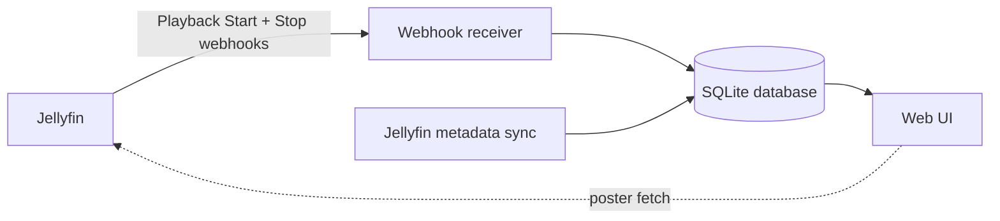

<p align="center">
  
</p>

# Tana 🎬

**Tana (棚, たな, “shelf” in Japanese) is a privacy-friendly, self-hosted watch-history tracker for Jellyfin.** It records completed movie and episode plays server-side from Jellyfin's Playback Stop webhook, tracks in-progress movie starts, lets you favorite items and manually mark a started movie as watched, stores everything in a local SQLite database, and serves a small web UI with statistics, filters, and poster images. All data stays on your own host; the only outbound traffic is to your Jellyfin server for metadata and posters.

AI tools were used during development.

## 🙋 Why Tana?

There are other great self-hosted tracking projects, such as [Yamtrack](https://github.com/FuzzyGrim/Yamtrack). I created Tana for two reasons: first, I wanted a simpler way to track my watch history; second, I wanted to see how far I could get with agentic coding, as I’m open to new technologies and approaches to software development.

## 🧭 How it works


```mermaid
flowchart LR
    A[Jellyfin] -->|Playback Start + Stop webhooks| B[Webhook receiver]
    B --> C[(SQLite database)]
    D[Jellyfin metadata sync] --> C
    C --> E[Web UI]
    E -. poster fetch .-> A
```

Confirmed Playback Stop completion events are the only source of watched rows, play counts, and heatmap activity. Tana never imports Jellyfin's `Played` history or `PlayCount`: tracking starts empty, and only the configured user's finished plays create counted rows. Movie Playback Start events add a separate *started* state, and local favorite/manual-watched actions are stored as first-class, upgrade-safe flags. A webhook receiver stores accepted events, a daily sync refreshes poster and IMDb metadata from Jellyfin, and the Zola-built UI renders stats, a started/watched list, and media.

## 🚀 Quick start

1. Copy `example.env` to `.env` and set `JELLYFIN_API_KEY` (create one in Jellyfin under **Dashboard → API Keys**) and `JELLYFIN_USER_ID`. `JELLYFIN_URL` defaults to `http://jellyfin:8096` in Compose; adjust it to an address reachable from the Tana container. Non-secret settings live in the `environment:` block of `docker-compose.yaml`; only the API key is required in `.env`.
2. Create the host data directory. Compose runs the container as non-root UID/GID `10001:10001`, and the mounted `/data` directory must be writable by it:

   ```sh
   mkdir -p ./tana-data
   sudo chown -R 10001:10001 ./tana-data
   ```

3. Start and follow the logs:

   ```sh
   docker compose pull
   docker compose up -d
   docker compose logs -f tana
   ```

The example Compose file pulls the published `ghcr.io/divin/tana` image; no local Docker build is needed. It maps host port `8000` to container port `8000` on all host interfaces. Tana has no login, so only expose it to a trusted LAN or place it behind an authenticated reverse proxy, and keep the webhook endpoint private. Containers are published only on plain version tags; `:latest` always points at the newest tagged release, so `docker compose pull` after a release updates the running image.

## 🎬 Watch tracking

Tana records a movie or episode as watched only when Jellyfin sends a `PlaybackStop` event for the single user in `JELLYFIN_USER_ID` with `PlayedToCompletion=true` — or, when that flag is missing, when the stop reached `PLAYBACK_COMPLETION_THRESHOLD` (default `1.0`; valid `0.5`–`1.0`) of the runtime. Movie `PlaybackStart` events create a separate *started* state that never counts as a play: the UI shows `Started` with the started date, and shows prior verified plays as `Previously watched …` without implying the current start is complete. Local heart buttons mark items as favorites, and a `Mark watched` button on a started movie (with `Undo manual mark` to revert) records a manual correction that never fabricates a playback event — it does not increment play counts or add to the activity heatmap. Starts, progress, incomplete stops, duplicate deliveries, manual marks, and favorites never increment counts; the first completion is one play and later completions count as rewatches. Configure Jellyfin's Webhook plugin with both Playback Start and Playback Stop as described in [Jellyfin webhook setup](docs/jellyfin-webhook.md).

## 📊 Web UI

Tana's index page shows total plays and activity over time, media with posters, rewatch/started/manual labels, IMDb links for movies, kind/status/date filters and a favorites toggle, local favorite hearts, `Mark watched`/`Undo manual mark` controls on started movies, and 7/30-day statistics including started movies. Timeline data respects the configured `TZ`. The theme choice is stored locally in the browser. The app has no login; anyone who can reach it can also change favorites and manual state, so keep it on a trusted LAN or behind an authenticated reverse proxy.

## 💾 Data and privacy

The SQLite database and resized poster files live together under the mapped host directory, so back them up together (for example stop the container and `tar -czf` the directory; Tana recreates posters on demand if the `posters/` folder is removed). Webhook bodies, item IDs, and secrets are never logged. Tana only talks to its configured Jellyfin server; it reports nowhere else.

## ⬆️ Upgrading

Version 2.0.0 uses SQLite schema version 4. A Tana 1.x database (schema version 3) is migrated in place on its first start: every watched row, completion event, poster-cache entry, and sync status is preserved, and existing rows become verified `watched` rows with no starts, manual marks, or favorites. Older experimental schema versions (1/2) are still reset to create a fresh database. Back up the data directory before upgrading, then start the new image — Tana performs the migration automatically. Favorites, manual corrections, and started-state timestamps survive restarts, syncs, and further upgrades.

## 🧪 Development

Use Python 3.12, [`uv`](https://docs.astral.sh/uv/), Zola 0.23.6, Node.js 22, and [`just`](https://just.systems/). Copy `example.env` to `.env` (gitignored) for local runs, then from the repository root:

```sh
just sync  # Install the locked backend environment
just       # Run all checks and tests
just run   # Build the site and start a LAN-accessible server on port 8000
```

`just run` stores its database and posters in the ignored `.local-data/` directory and leaves the production `/data` path untouched. Remove `.local-data/` to discard the test copy.
